# Linear Regression

## Linear Regression(MSE)
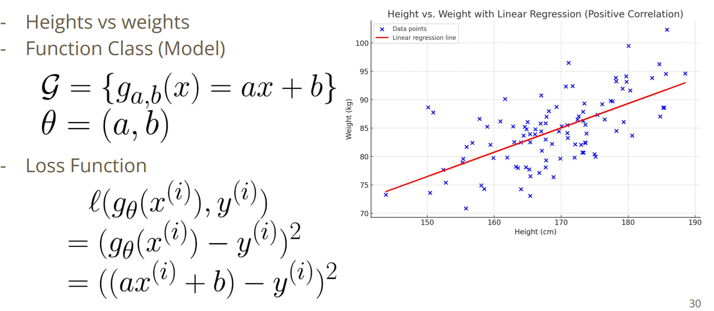

 

## Linear regression (Multidimension)
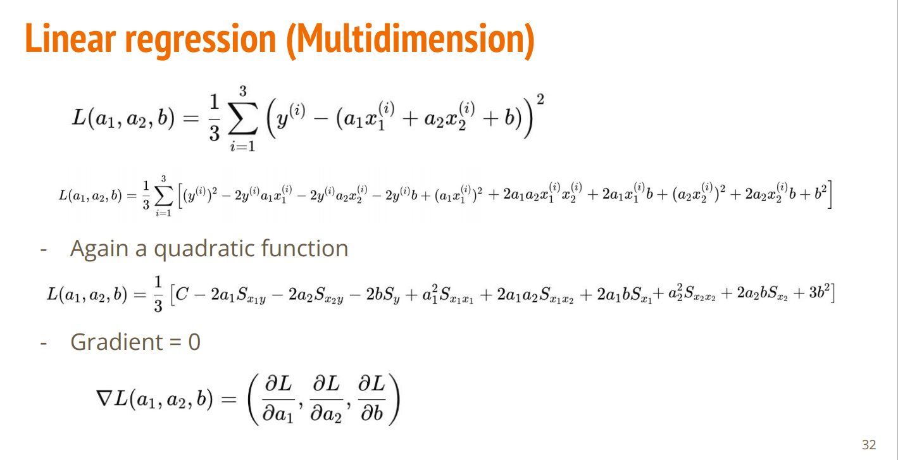
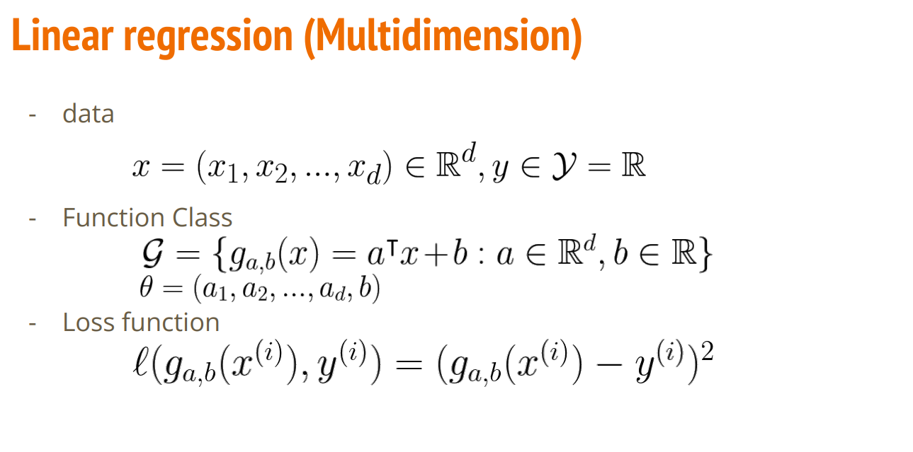

 

## Normal Equation
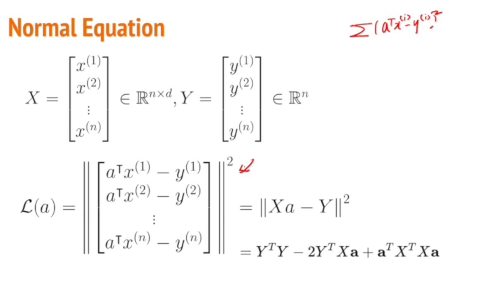
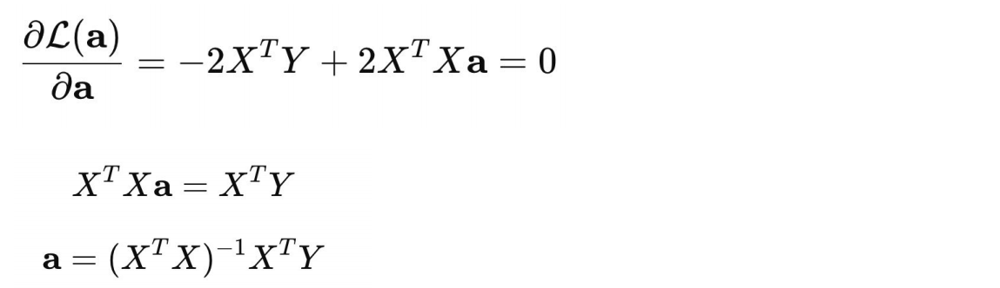

 

## 2차함수
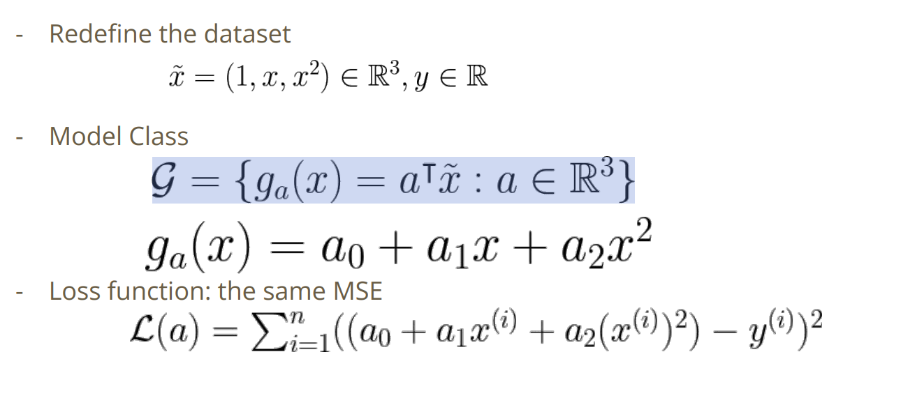

 

## Overfitting
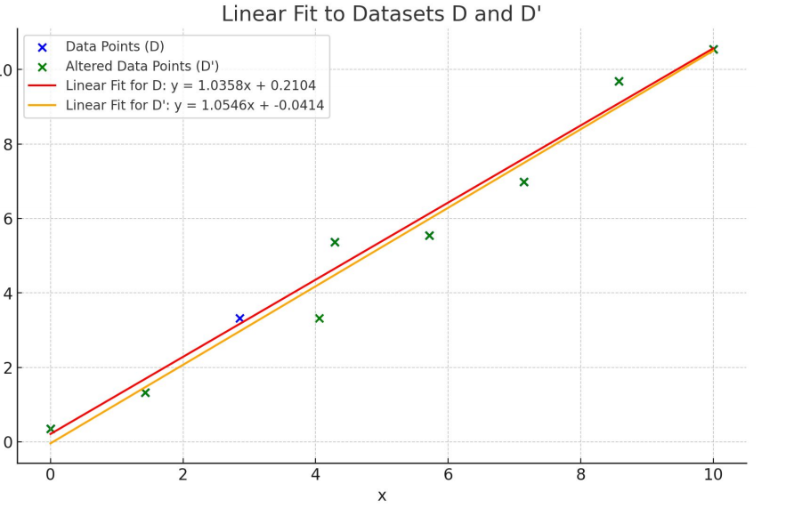
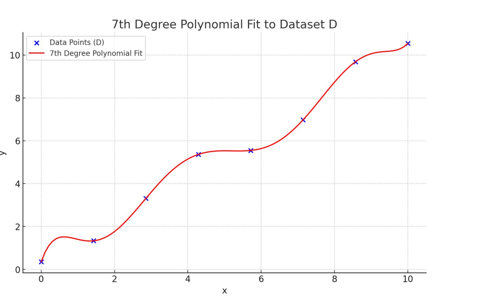
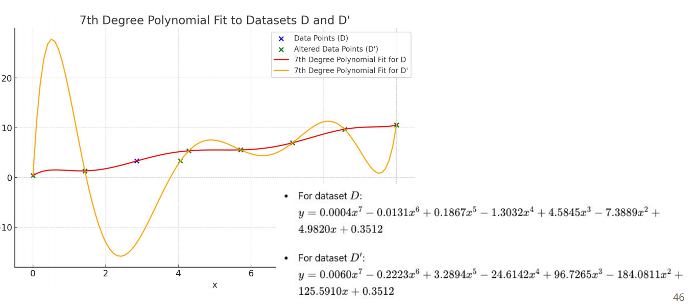

- overfitting 문제

- 해결하는 방법: 데이터를 굉장히 많이 주는 것
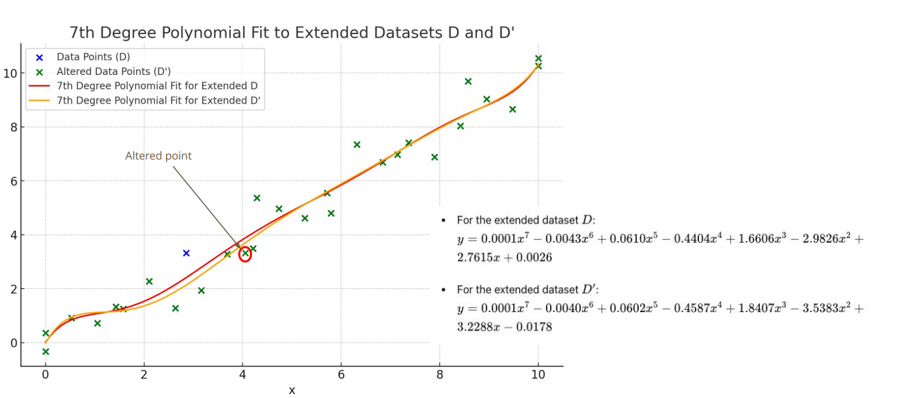
- 데이터를 더 이상 못얻거나 충분히 확보하지 못하는 경우도 많음
- 얼마나 복잡한 모델을 사용해야하는가?
  - 모델의 성능이 너무 떨어지는 경우(과소 적합)
  - 적절하게 표현하는 경우(적합)
  - overfitting(고분산)

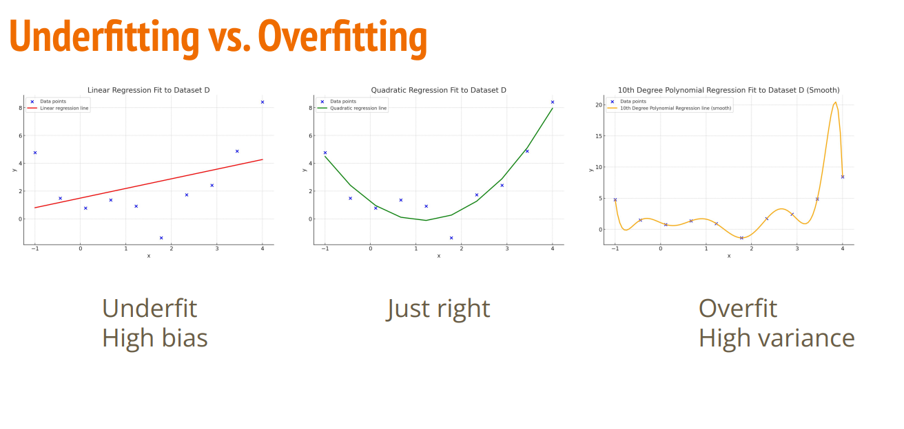

## 어떻게 overfitting을 알아내는가?
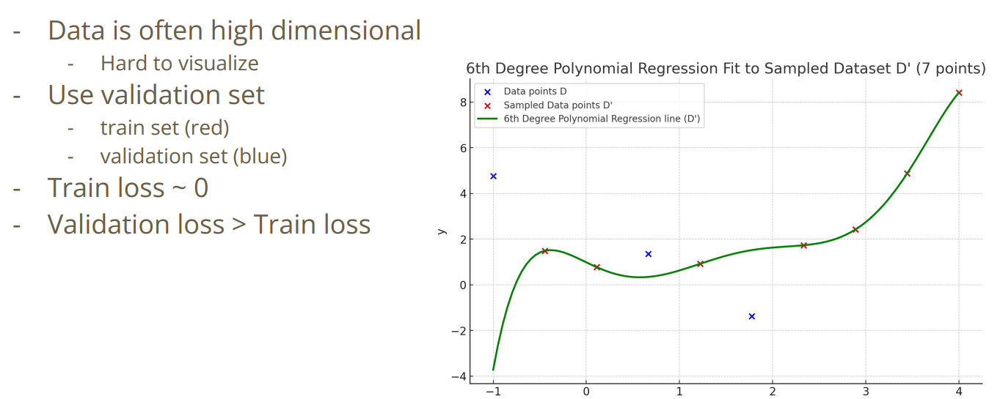