# Supervised Learning Overview 

## 지도학습
- 지도학습이란: 컴퓨터에게 문제들을 풀도록 학습시키는 것
- ex) Image Classification, Text Classification(긍정적? 부정적?), Next Word Prediction, Translation, Price Prediction
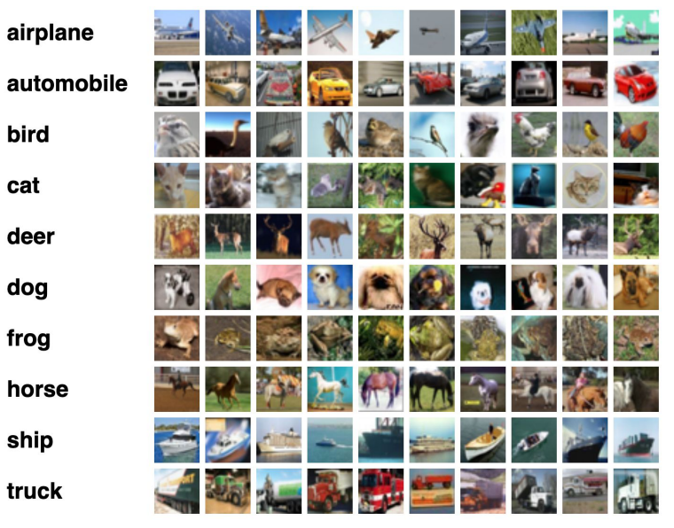
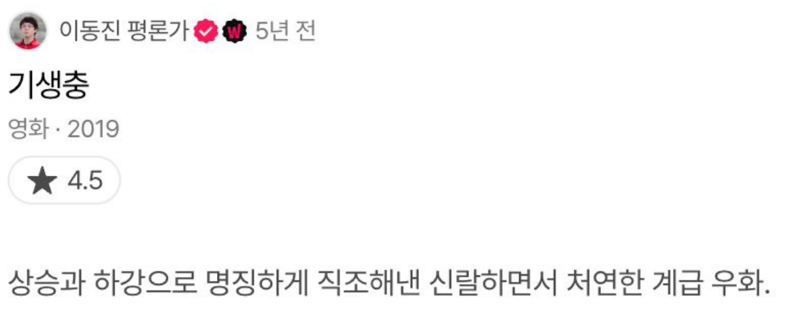
- 문제와 정답이 있고 이것을 페어 시키는 것

 

## Supervised Learning
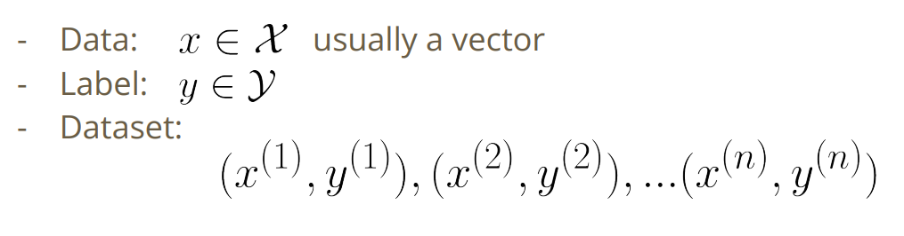
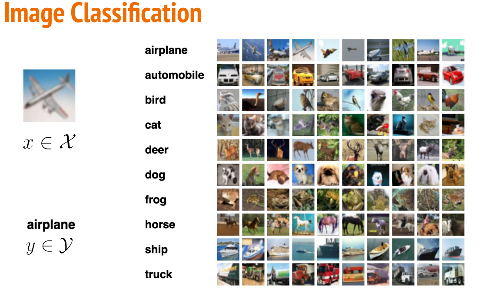
- 벡터 -> 백터 or 벡터의 수열

 

## Before Machine Learning
- 경험, 전문가들의 규칙으로 알고리즘 구현
- 데이터를 다양하게 입력과 그에 대응되는 레이블 혹은 문제와 정답 쌍을 주고 알고리즘이 규칙을 파악해서 사람이 아닌 본인이 스스로 학습하는 방법
- "컴퓨터가 스스로 학습하게 하고 직접적으로 어떻게 하라고 지시하지 않고 스스로 규칙을 파악하도록 하게 하는 것"

 

## Supervised Learning
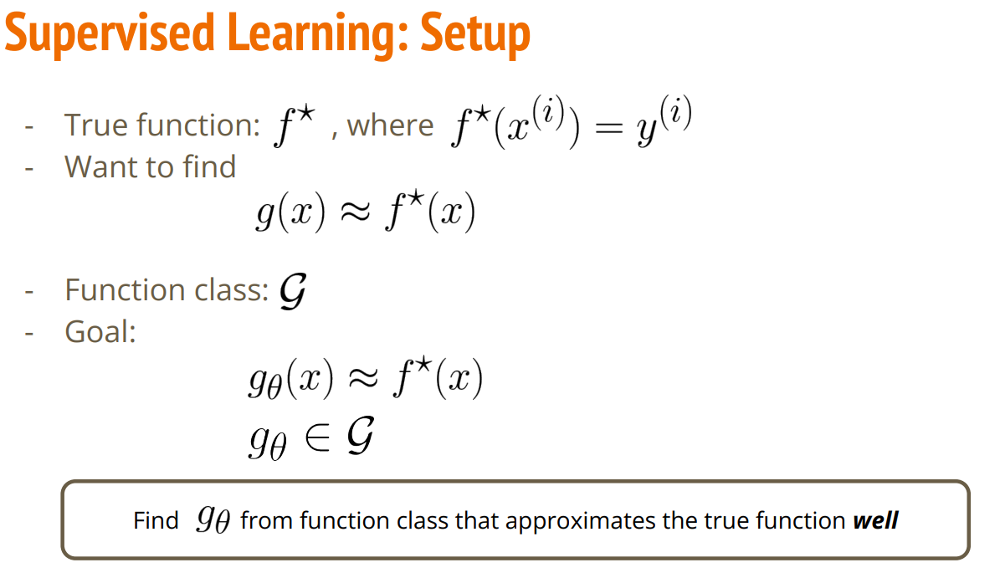
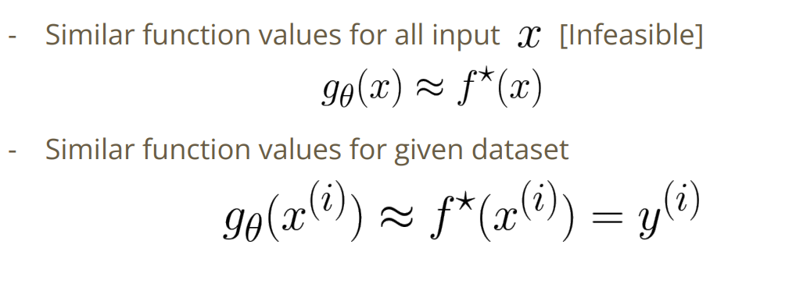
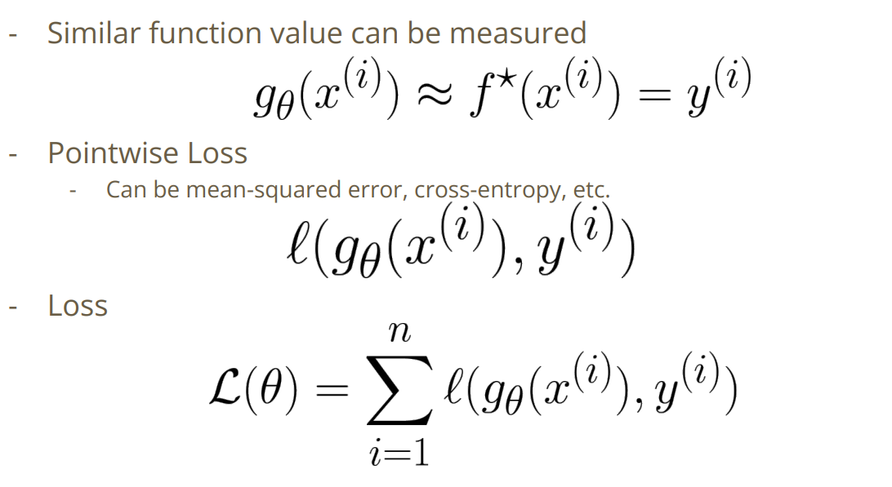
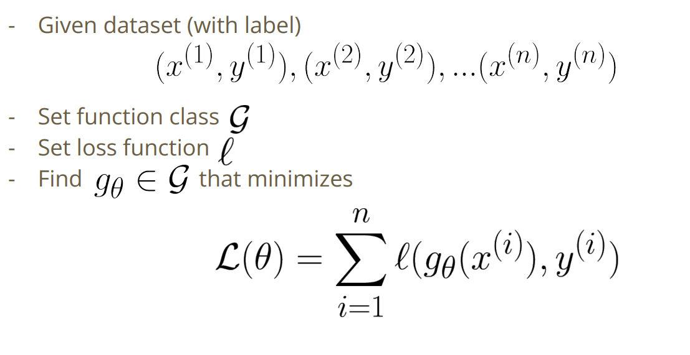
- 클래스 g안에서 가장 정답 함수와 비슷한 함수

 

## Linear regression example
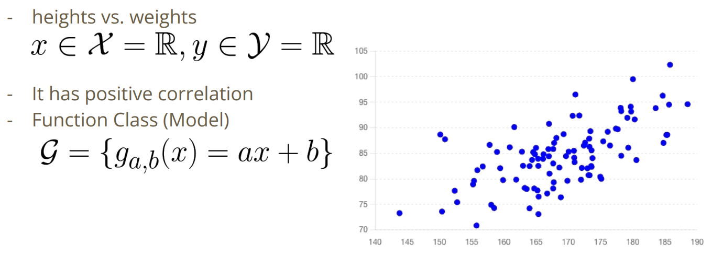
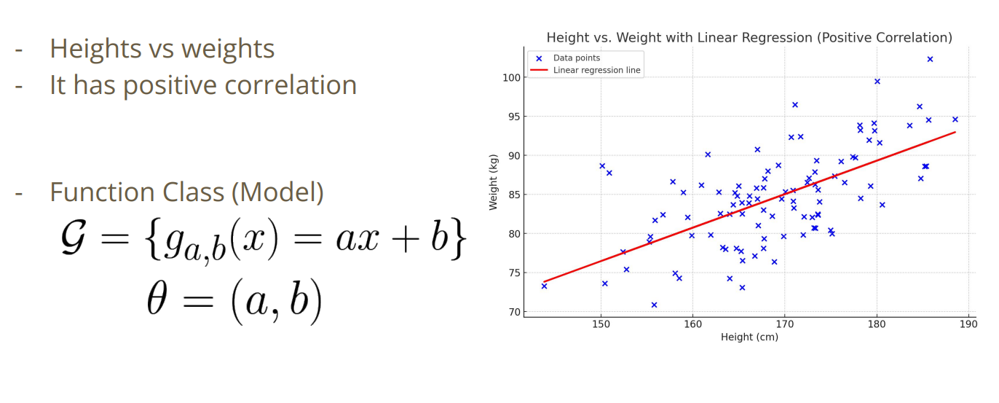
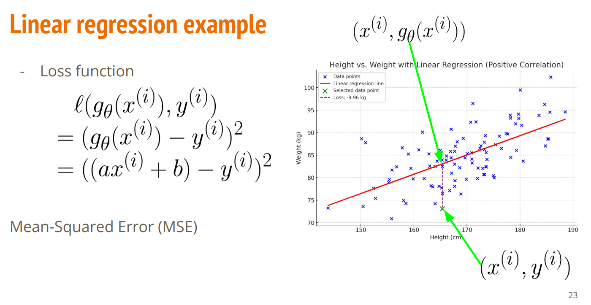
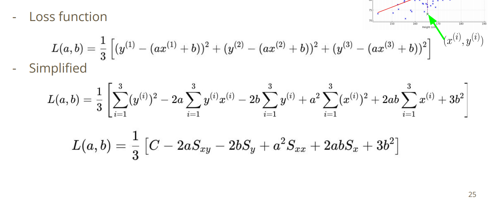
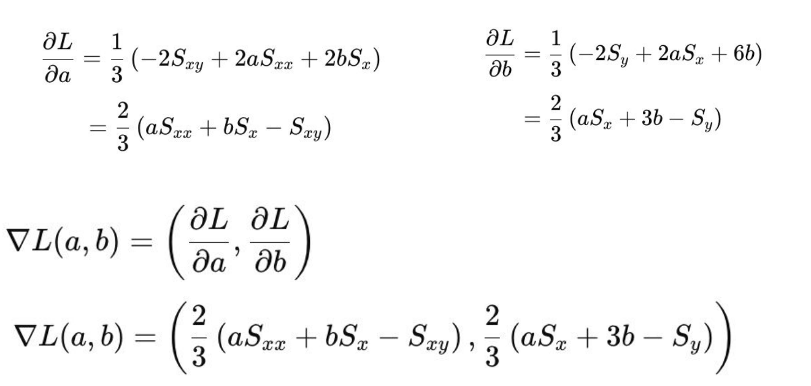
- 손실함수
- 왜 제곱을 하는지?, 왜 수직 거리를 사용하는지?
- MSE를 사용해야하는 이유는 없음 -> 전통적으로 혹은 분석에 용이해서

 

## overfitting이 일어났을때
- 차수를 줄인다
- 가능하다면 데이터를 얻는다
  - 더 복잡함
  - 더 가격이 들수도 있음
- Regularization
- Augmentation

 

## Cross Validation
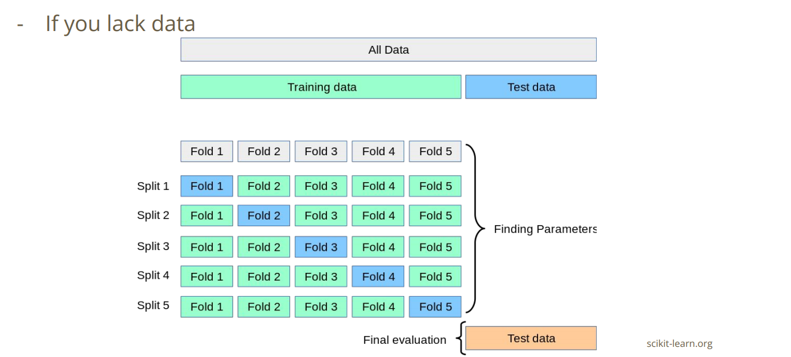

 

## Regularization(정규화)
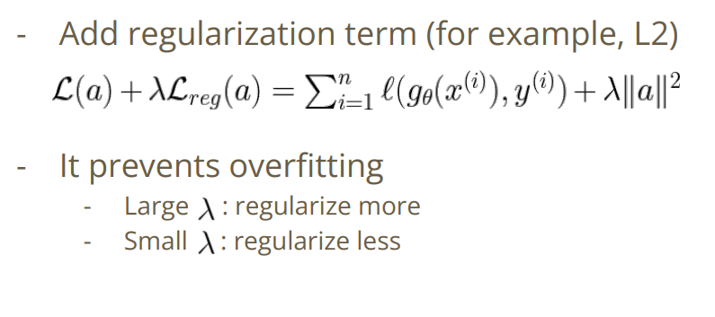

 

## Augmentation 
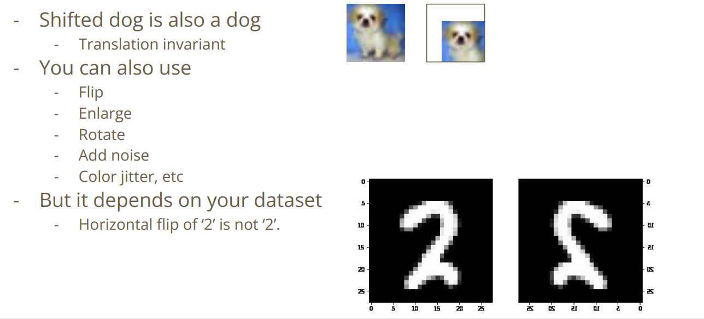
- 강아지의 위치를 변경
- 회전
- 밝기 조절
- 단 숫자 같은 경우 좌우 반전 등은 되지 않음